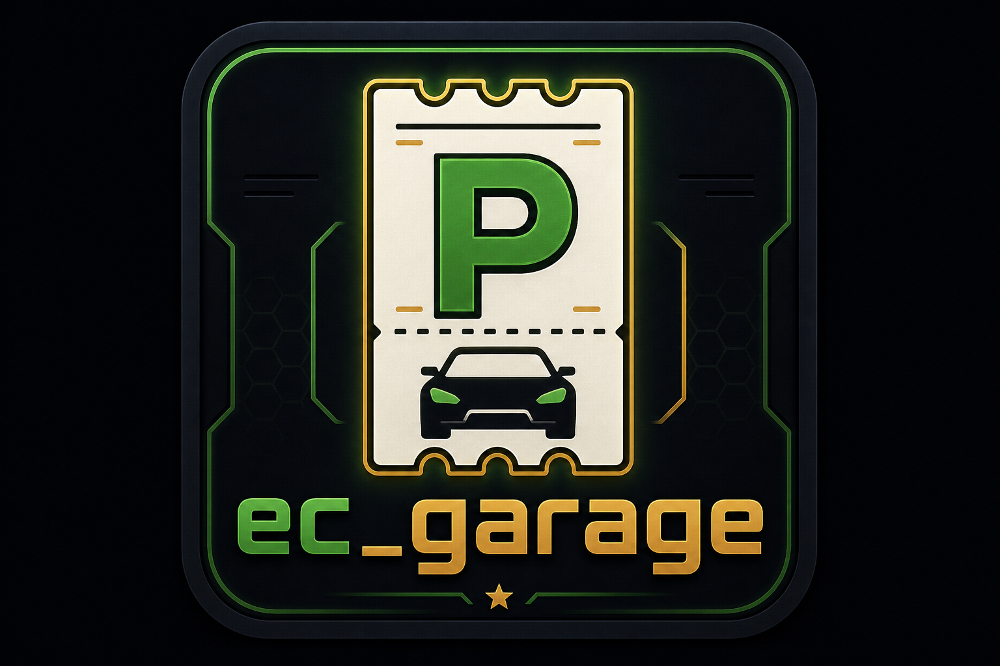

<p align="center">
  
</p>

<p align="center">
  
</p>

<h1 align="center">EC Garage</h1>

<p align="center">
  <strong>Garage-System für FiveM</strong> — Land, Luft, Wasser & Impound, ingame Creator, DB-Sync.
</p>

<p align="center">
  <a href="https://github.com/EuroCent82/ec_garage/releases"></a>
  <a href="https://docs.fivem.net/"></a>
  <a href="https://github.com/EuroCent82/ec_garage"></a>
</p>

---

## Überblick

**ec_garage** ist ein modernes Garagen-System für Roleplay-Server — NUI im **EC-Chat-Look**, Garagen aus der Datenbank und ein **ingame Creator**, der Änderungen sofort für alle Spieler synchronisiert.

| Feature | Status |
| --- | --- |
| Garage-NUI (Land · Luft · Wasser · Impound) | ✅ ingame |
| Creator-UI + Speichern in `ec_garages` | ✅ ingame |
| Live-Sync (Blips, Props, ox_target) | ✅ |
| Fahrzeuge aus ESX `owned_vehicles` | ✅ lesen & Meta |
| Ausparken an freien Spawn-Slots | ✅ |
| Admin: Garage bearbeiten / löschen (Target) | ✅ |
| Einparken (vollständiger Park-Flow) | ⏳ folgt |

**Framework:** ESX (Fahrzeuge) · QBCore / Qbox (vorbereitet)

Resource-Name: **`ec_garage`**

---

## Highlights

| Bereich | Beschreibung |
| --- | --- |
| **UI** | Glass-Panel, 2-Spalten-Karten, Theme wie `ec_chat_theme` |
| **Creator** | `/creategarage` — Positionen, Blip, Prop, Slots; Speichern → DB + Broadcast |
| **Welt** | Ticket-Prop, Blip, **ox_target** / Marker, geschützte Standard-Garage |
| **Ausparken** | Nur wenn ein Spawn-Slot frei ist; optional Warp ins Fahrzeug |
| **Debug** | `/garagedebug` — Slot-Marker (admin/manager) |

---

## Installation

1. **[Release v0.0.1](https://github.com/EuroCent82/ec_garage/releases)** laden (`ec_garage.zip`)
2. Entpacken nach `resources/[local]/ec_garage/`
3. SQL ausführen:
   - `sql/install.sql`
   - `sql/seed_wuerfelpark.sql` (Beispiel-Garage am Casino-Parkplatz)
4. In `server.cfg` (Reihenfolge beachten):

   ```cfg
   ensure oxmysql
   ensure ec_garage
   ```

5. Optional: `es_extended` für Fahrzeugliste & Gruppen (`admin`, `manager`)

---

## Konfiguration

| Datei | Inhalt |
| --- | --- |
| `config.lua` | Framework, Target, Creator-Gruppen, Spawn, Debug |
| `config/garages.lua` | Fallback-Template (`GarageConfigTemplate`) |

Wichtige Optionen:

| Option | Standard | Wirkung |
| --- | --- | --- |
| `UseDatabaseGarages` | `true` | Garagen aus DB statt nur Lua |
| `CreatorGroups` | admin, manager | Zugriff auf Creator |
| `SpawnSlotRadius` | `4.0` | Freier Slot beim Ausparken |
| `ProtectedGarageIds` | `wuerfelpark` | Löschen im Target blockiert |

📖 [docs/DATABASE.md](./docs/DATABASE.md)

---

## Ingame

| Befehl / Aktion | Funktion |
| --- | --- |
| `/creategarage` | Garagen-Creator öffnen |
| `/garageui [modus]` | UI testen (`land`, `air`, `water`, `impound`) |
| `/garagedebug` | Spawn-Slot-Marker (admin/manager) |
| **Target / E** | Garage am Prop öffnen |
| **Garage bearbeiten** | Admin-Target (Creator mit vorausgefüllter ID) |
| **Garage löschen** | Admin-Target (geschützte IDs ausgenommen) |

Fahrzeuge erscheinen in der UI, wenn `owned_vehicles.parking` der Garage-ID entspricht (z. B. `wuerfelpark`).

**Speichern im Creator:** schreibt in `ec_garages` / `ec_garage_slots` und synchronisiert sofort alle Clients.

---

## Voraussetzungen

- **oxmysql** (Pflicht)
- **ox_target** oder **qb-target** (empfohlen bei `InteractMode = 'target'`)
- ESX mit `owned_vehicles` für Fahrzeugliste & Ausparken

---

## Download

| Kanal | Link |
| --- | --- |
| **Release-ZIP** | [Releases](https://github.com/EuroCent82/ec_garage/releases) → `ec_garage.zip` |
| **Quellcode (öffentlich)** | [ec_garage](https://github.com/EuroCent82/ec_garage) |
| **Entwicklung (privat)** | [ec_garage_dev](https://github.com/EuroCent82/ec_garage_dev) |

---

<p align="center">
  <strong>ec_garage</strong> · EuroCent82<br>
  <sub>Garage System — built for FiveM roleplay servers.</sub>
</p>
